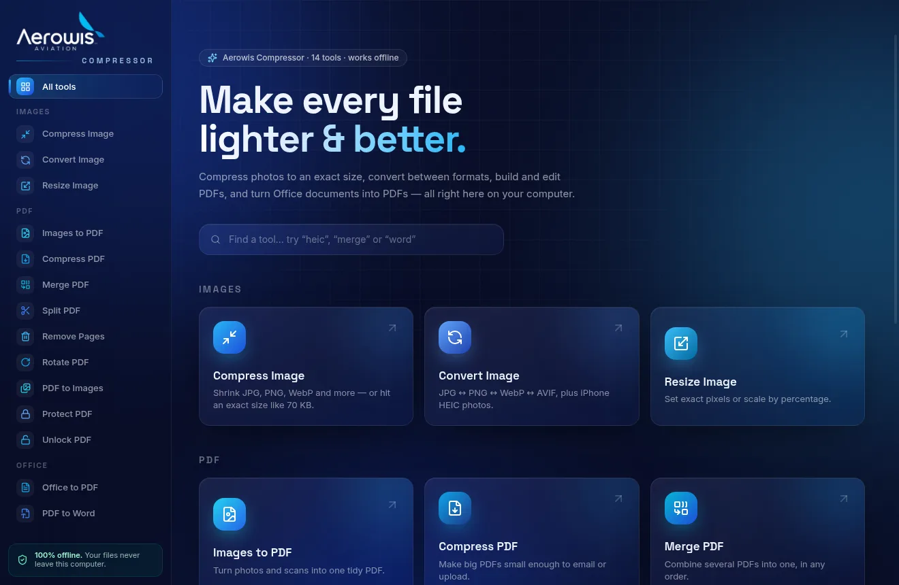
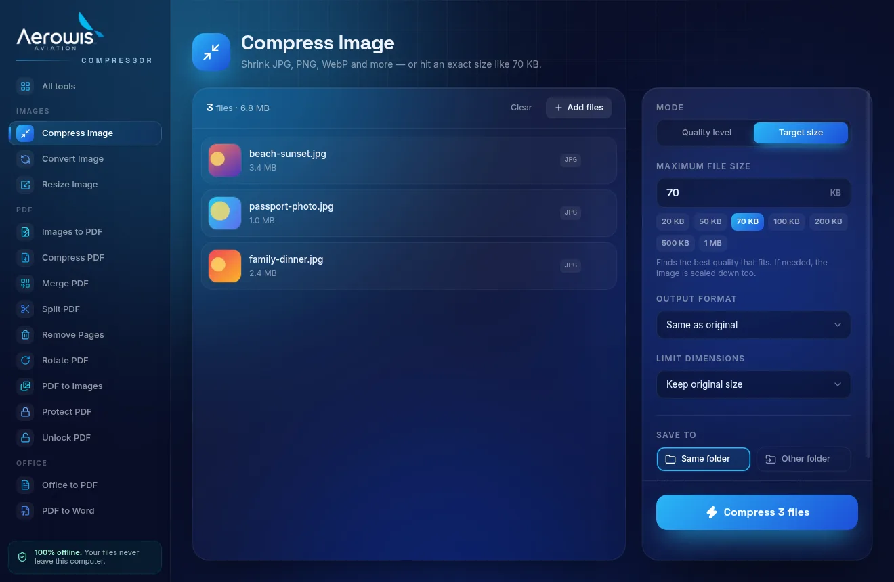
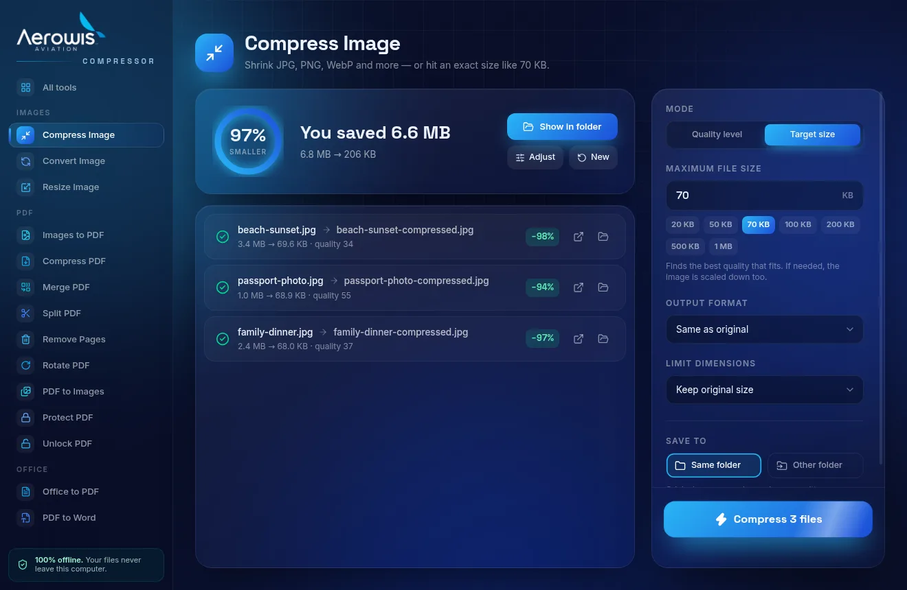

# Aerowis Compressor

A desktop app for Windows and macOS that compresses, converts and edits images, PDFs and Office documents, all **offline, on your own computer**. Think iLovePDF, without the uploads.



| Compress to an exact size | Results |
|---|---|
|  |  |

## Tools

| | Tool | What it does |
|---|---|---|
| 🖼 | **Compress Image** | JPG, PNG, WebP, AVIF, GIF, HEIC. Pick a quality level, or a **target size** ("make it under 70 KB") and it finds the best quality that fits, shrinking the dimensions only if it must. |
| 🖼 | **Convert Image** | JPG ↔ JPEG ↔ PNG ↔ WebP ↔ AVIF ↔ GIF ↔ TIFF, plus iPhone HEIC and SVG input |
| 🖼 | **Resize Image** | By percentage or exact pixels (fit, crop or stretch) |
| 📄 | **Images to PDF** | A4 / Letter / fit-to-image pages, margins, orientation, quality |
| 📄 | **Compress PDF** | Four levels (300 → 50 dpi), or a target size; optional black & white |
| 📄 | **Merge PDF** | Drag to reorder, then merge |
| 📄 | **Split PDF** | Every page, by ranges (`1-3, 5, 8-`), or extract pages into one file |
| 📄 | **Remove Pages** / **Rotate PDF** | Page ranges supported |
| 📄 | **PDF to Images** | JPG or PNG at 72 / 150 / 300 dpi |
| 📄 | **Protect / Unlock PDF** | AES-256 passwords |
| 📝 | **Office to PDF** | Word, Excel, PowerPoint, ODT, RTF, TXT, CSV |
| 📝 | **PDF to Word** | Editable .docx |

Batch processing everywhere: drop in 50 files and they're all processed. Originals are never modified; results are saved next to them (or in a folder you choose).

## Installing on your computers

Use the one-click links in [Download](#download) at the bottom of this page. They always point at the newest build: every push to the app's branch rebuilds the installers (~10 min) and publishes them as a GitHub Release.

The app isn't code-signed (signing needs a paid certificate), so the first launch needs one extra click:

- **Windows:** "Windows protected your PC" → **More info → Run anyway**.
- **macOS:** open it once, then go to **System Settings → Privacy & Security** and click **Open Anyway**. If macOS says the app "is damaged", run `xattr -cr "/Applications/Aerowis Compressor.app"` in Terminal.

### Office conversions

Word/Excel/PowerPoint conversions use:

- **Microsoft Office** on Windows, if it's installed (best fidelity), otherwise
- **[LibreOffice](https://www.libreoffice.org/download/download-libreoffice/)**, which is free. Install it once per computer. It isn't bundled because it's ~350 MB.

The app detects which one is available and shows a download button if neither is.

Every other tool works with nothing extra installed.

## Development

Requires Node.js 22+.

```bash
npm install
npm run dev          # run the app with hot reload
npm run typecheck    # TypeScript checks
npm run smoke        # runs every tool against generated sample files
npm run dist:win     # build the Windows installer (run on Windows)
npm run dist:mac     # build the macOS .dmg files (run on a Mac)
```

### How it's built

- **Electron + React + TypeScript + Tailwind CSS + Framer Motion** (via electron-vite)
- **sharp** (libvips, MozJPEG) for images, **heic-convert** for iPhone photos
- **pdf-lib** for building and editing PDFs
- **Ghostscript** and **qpdf** compiled to WebAssembly for PDF compression, rendering and passwords. They run identically on Windows and Mac with nothing to install.
- **LibreOffice / Microsoft Office** (headless) for Office documents

All processing runs in a separate background process (`src/main/worker.ts`), so the window stays smooth during big jobs.

```
src/
├── main/
│   ├── index.ts         window, dialogs, IPC
│   ├── worker.ts        background processing process
│   └── engines/         image.ts · pdf.ts · office.ts · wasm.ts · runner.ts
├── preload/             safe bridge between the UI and the app
├── renderer/src/        React UI (tools/registry.ts defines every tool and its options)
└── shared/types.ts
```

To add a tool: add its definition to `src/renderer/src/tools/registry.ts`, write the function in an engine, and register it in `src/main/engines/runner.ts`.

## License

Ghostscript is AGPL-licensed, so this app is AGPL-3.0 too. That's no problem for personal use; it only matters if you ever distribute or sell it.

## Download

| Your computer | One-click download |
|---|---|
| 🪟 **Windows** | [⬇ Aerowis-Compressor-Setup.exe](https://github.com/faisssss/compressor-tool/releases/latest/download/Aerowis-Compressor-Setup.exe) |
| 🍎 **Mac with Apple Silicon** (M1, M2, M3, M4) | [⬇ Aerowis-Compressor-mac-arm64.dmg](https://github.com/faisssss/compressor-tool/releases/latest/download/Aerowis-Compressor-mac-arm64.dmg) |
| 🍎 **Mac with Intel chip** | [⬇ Aerowis-Compressor-mac-x64.dmg](https://github.com/faisssss/compressor-tool/releases/latest/download/Aerowis-Compressor-mac-x64.dmg) |

Not sure which Mac you have? Apple menu → **About This Mac**: "Chip: Apple M…" means Apple Silicon, "Processor: Intel" means Intel.
